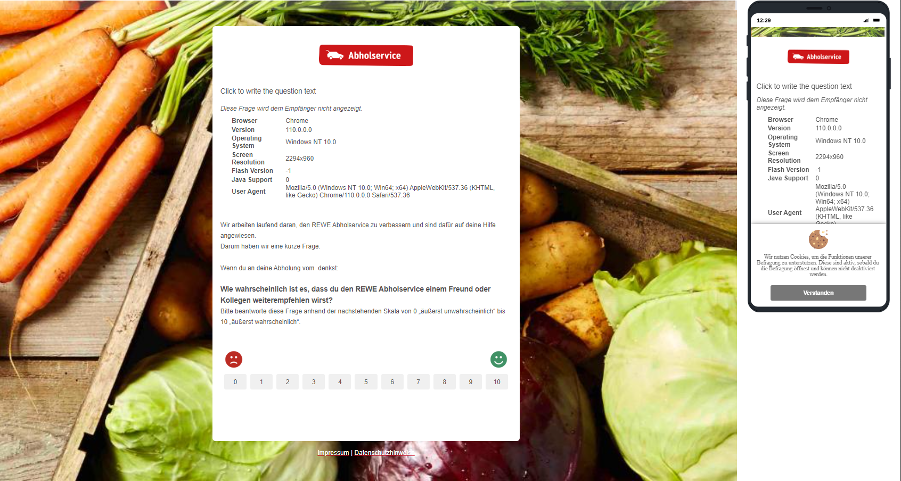
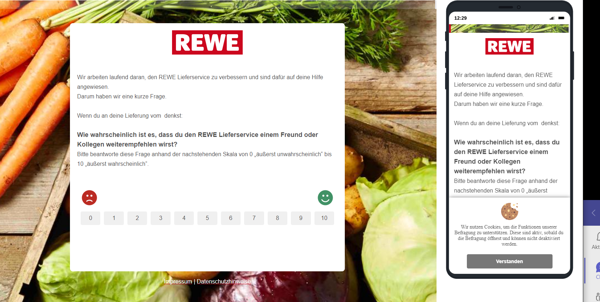

# Rewe FuFi LS |  Rewe FuFi AB - Verknüpfung Trustpilot

### Remarks :
- Rewe FuFi is a survey for reactions and ratings from customers. With this you can express your opinion there and also rate us through trustPilot

[Project link Fulfillment Abholservice:](https://rewegroup.eu.qualtrics.com/survey-builder/SV_78VvVVHygoNJmwR/edit)

[Project link Fulfillment Lieferservice:](https://rewegroup.eu.qualtrics.com/survey-builder/SV_5punoIkqLyYIzTT/edit)

[Information:](https:/support.trustpilot.com/hc/de/articles/115004145087--Business-Generated-Links-for-developers-__;!!LmobyQ!oPez_ntOQfm7GkY7cgmHaFM6S6nfHkbI1MAiwjEEfkNNtmZ8CYPQc24GGTgf2q-KsxV8xfvZr8L1l5SzxF4F$)

## **Install :**

- [npm install --save-dev webpack:](https://webpack.js.org/guides/installation/)
- [npm i less:](https://www.npmjs.com/package/less)
- [npm i less-loader:](https://www.npmjs.com/package/less-loader)
- [npm i nodemon:](https://www.npmjs.com/package/nodemon)
- [npm i webpack-cli:](https://www.npmjs.com/package/webpack-cli)

## **Start:**
- npm run start

